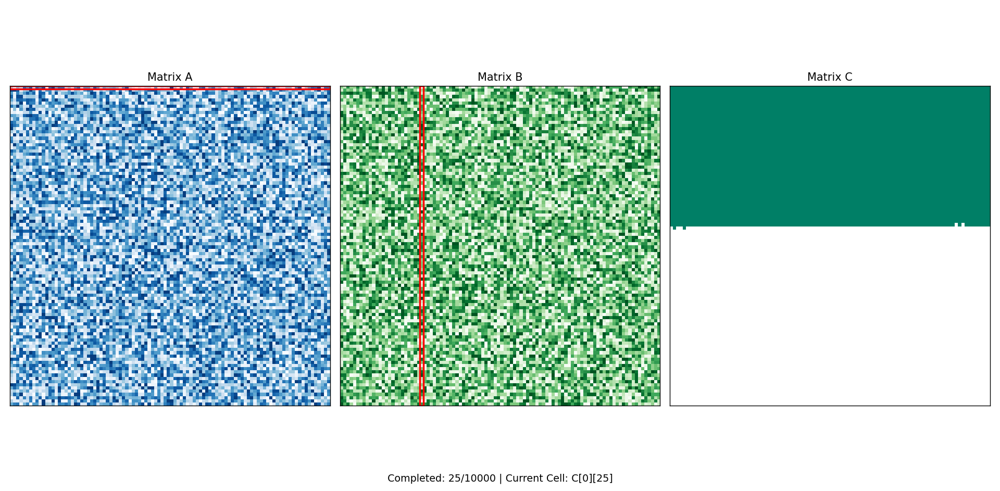

# Matrix Multiplication Visualization Using Multithreading

## 📌 Project Overview

This project demonstrates how matrix multiplication can be performed using multithreading and visualized in real time. The program generates two random 100 × 100 matrices, multiplies them using multiple threads running in parallel, and displays an animation showing how the result matrix is built cell by cell.

Along with the matrix multiplication project, this repository also contains a Java implementation of the classic Producer–Consumer problem to demonstrate thread synchronization and inter-process communication concepts.

The main goal of this project is to understand parallel computing, thread management, synchronization, and performance optimization while providing a visual representation of the execution process.

---

## 🚀 Features

### Matrix Multiplication Module
- Generates two random 100 × 100 matrices
- Performs matrix multiplication using multithreading
- Utilizes all available CPU cores
- Tracks the order in which cells are computed
- Visualizes Matrix A, Matrix B, and Matrix C
- Highlights the active row and column during computation
- Displays real-time progress updates
- Saves the complete animation as a GIF

### Producer–Consumer Module
- Demonstrates synchronization between threads
- Uses `wait()` and `notify()` methods
- Simulates a producer generating data
- Simulates a consumer consuming data
- Prevents race conditions using synchronization

---

## 🛠 Technologies Used

### Python Project
- Python 3
- TensorFlow
- NumPy
- Matplotlib
- ThreadPoolExecutor
- Pillow

### Java Project
- Java
- Multithreading
- Synchronization
- wait() and notify()

---

## 📂 Project Files

```text
├── matrixmult.py
├── ProducerConsumer.java
├── matrix_multiplication.gif
└── README.md
```

---

## ⚙️ How Matrix Multiplication Works

### Step 1: Generate Matrices

Two random matrices A and B of size 100 × 100 are generated.

### Step 2: Parallel Computation

Each element of Matrix C is calculated independently using worker threads.

Formula used:

C[i][j] = Σ(A[i][k] × B[k][j])

Each thread computes one cell of the result matrix.

### Step 3: Track Completion Order

As threads finish their tasks, the order of completed cells is stored.

### Step 4: Animation

The animation displays:

- Matrix A in blue
- Matrix B in green
- Matrix C being filled gradually
- Active row highlighted in Matrix A
- Active column highlighted in Matrix B
- Live progress information

### Step 5: GIF Export

After all computations are completed, the animation is automatically saved as:

```text
matrix_multiplication.gif
```

---

## ▶️ Running the Python Project

### Install Required Libraries

```bash
pip install tensorflow numpy matplotlib pillow
```

### Run the Program

```bash
python matrixmult.py
```

---

## 📊 Sample Output

### Matrix Multiplication Output

```text
Matrix multiplication completed

Execution Time: 4199.60 ms

First 3 x 3 Result Sample:

[9659, 9607, 8301]
[10081, 9418, 8810]
[10538, 10210, 9344]

Saving GIF...

GIF saved successfully as 'matrix_multiplication.gif'
```

---

## 🎥 Animation Preview

Add your generated GIF to the repository and display it using:

```markdown
## Demo


```

This allows visitors to see the animation directly on GitHub.

---

## ☕ Producer–Consumer Problem

The repository also includes a Java implementation of the Producer–Consumer problem.

### Concept

- Producer creates data.
- Consumer consumes data.
- Synchronization ensures that the producer does not overwrite data before it is consumed.
- Consumer waits when no data is available.
- Producer waits when data has not yet been consumed.

### Sample Output

```text
Producer produced: 1
Consumer consumed: 1
Producer produced: 2
Consumer consumed: 2
Producer produced: 3
Consumer consumed: 3
Producer produced: 4
Consumer consumed: 4
Producer produced: 5
Consumer consumed: 5
```

---

## ▶️ Running the Java Program

Compile:

```bash
javac ProducerConsumer.java
```

Run:

```bash
java ProducerConsumer
```

---

## 📚 Concepts Demonstrated

- Matrix Multiplication
- Parallel Computing
- Multithreading
- Thread Synchronization
- Producer–Consumer Problem
- TensorFlow Operations
- Data Visualization
- Animation using Matplotlib
- wait() and notify()
- Concurrent Programming

---

## 🎯 Learning Outcomes

Through this project, I learned:

- How multithreading improves computational performance
- How tasks can be distributed among multiple threads
- How thread synchronization works
- How to visualize algorithm execution
- How Producer–Consumer synchronization is implemented
- How to create and export animations using Python

---

## 🔮 Future Enhancements

- Support larger matrix sizes
- Add performance comparison graphs
- Export animations as MP4 videos
- Add a graphical user interface
- Visualize thread activity in real time
- Compare sequential and parallel execution speeds

---

## Conclusion

This assignment provided practical knowledge of multithreading concepts in both Java and Python. The Producer-Consumer problem demonstrated thread synchronization and communication using wait() and notify(), while the matrix multiplication task showed how large computations can be divided and executed concurrently using multiple threads. The animation further helped visualize the execution process, making it easier to understand how multithreaded programs work efficiently and safely.
